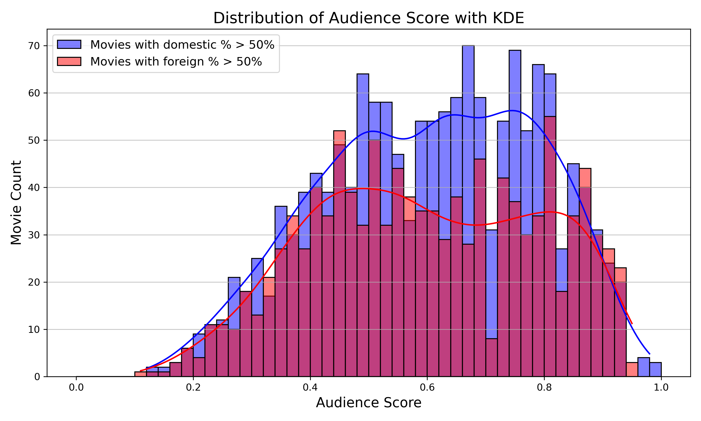

# The Call to Action

"Folks, **we’ve got a crisis.** Hollywood’s been around for over a century. We’re talking the biggest, highest-grossing movies in the world. But now, foreign movies—they’re coming in hot. They’re coming for our audiences, our **box office,** and, frankly, our jobs. It’s like the Oscars all over again—rigged!

Now, here’s the thing: Hollywood’s top people, the big shots, they’re calling me. They’re saying, ‘Mr. Trump, you’re the only one who can fix this.’ And I say, ‘You’re absolutely right.’ 

So here’s what we’re gonna do, folks. We’re smart, okay? Smarter than those guys. We’re going take a look at the data and have our experts analyse it. All the past American movies, who's buying them, Americans or foreigners, the influencing factors, everything. And we're going to use all that information to attract those foreign audiences. Huge audiences, all over the world, will watch our movies. **Made in America, baby.**

You better believe it folks! We’re going to outshine, outclass, and outplay every single foreign competitor, and **Make Hollywood Great Again!** "

Words from the former and future convicted President himself. So let's get started.

# Dataset

## Building the Data Wall

To understand the dynamics between domestic and international revenues, we began by collecting a variety of datasets:

The CMU dataset provided data on worldwide revenue, genre, and character tropes.
We supplemented this data with additional datasets from Kaggle, Box Office Mojo, IMDb, Rotten Tomatoes, and TheMovieDB, to include important variables like budget, domestic gross, and worldwide gross.

For more detailed insights, we web-scraped data from The Numbers (domestic and foreign gross), Rotten Tomatoes (reviews), Wikipedia (country and language), and Box Office Mojo (ratings and reviews).

After cleaning and merging the data, we focused on movies released between 2000-2019, with a total of 2689 movies that met our criteria of having at least 90 entries per year. This dataset is our starting point for uncovering trends that drive foreign revenue.

## Fact-checking Mr Trump

We decided to compare movies that generate most of their revenue domestically and internationally. We assign movies that make more than 50 % of their revenue internationally to the red class and the other movies to the blue class. Performing this split, we obtain 1145 movies with a higher foreign percentage and 1544 with a higher domestic percentage. We then compute the profitability of a movie by dividing the revenue by the budget



The outliers were removed from the box plots. From the box plots we can observe that the class with more than 50 % of their revenue coming from foreign countries has a higher median than the domestic class. However the red class shows a bit more variance. This confirms that movies that generate more of their revenue internationally are more profitable. Therefore Hollywood should focus on catering to an international audience.



The outliers were removed. Oh no! The foreign percentage steadily goes up until 2015. Then it starts going down. We need it to keep going up to maximize profits. The main goal of our analysis is to determine the factors influencing the foreign percentage.

## Influencing Factors

We've decided to look at the following factors:

- Date of Release (Year, Month)
- Genre
- Reviews (Audience, Critics)
- Ratings
- Budget
- Total Revenue
- Runtime

The result we want to look at is:
- Foreign revenue (gross, percentage)

# Data Exploration

Alright, folks, before the liberal left starts accusing me of **faking the numbers** again, let me set the record straight. We did something **smart**—we **adjusted the data**. Here’s the deal: **Inflation**—it’s a **huge factor**, believe me. If you compare the box office earnings of a **1990 movie** to a **2019 movie**, you're just asking for fake news. It’s a total disaster. So, we did the right thing: we **adjusted** for inflation! 

Now, we’ve got the real facts, folks. It’s not just about making a ton of money—it’s about making **smart money**. And guess what? We’ve done the work to make sure we’re getting the **truth**. We also have taken the log of some of our continuous variables including budget and profitability to make sure no pesky outliers get in the way of a readable clean graph. We’re not letting **inflation** or **outliers** fool us!

## Budget



Look at the data, folks—it's clear as day: **budget** is closely linked to **foreign percentage**. We've got a **Pearson coefficient** of **0.33**, and the **p-value** is **less than 0.05**—that’s statistically significant! This isn’t some fake news, it’s real data, proving that bigger budgets bring in more international success. Simple, folks!

Now, you might’ve already guessed it—more budget means more marketing, more attention, more box office sales. It’s intuitive, right? But here’s the kicker: **foreigners aren’t just watching American movies by default**—we’ve got to **grab their attention**. If we take this information at face value, it’s time to stop playing small and start focusing on the biggest blockbusters that will pull in those huge international numbers. That’s where the money is!

## Genre



Average, domestic > foreign, but not for fantasy, science fiction, adventure

## Month



## Runtime



From the runtime box plots we can observe that there is not much difference in the runtime of movies between the classes. The class where the domestic percentage dominates has a median of 103 and the other class, a median of 108. They both contain a similar amout of outliers. It is to note that for the blue class, there is one big outlier: a movie that has a runtime of 222 minutes.

## Ratings



“Alright, here’s the deal. We had to drop the ‘G’ rating, okay? The count was just too low. You can’t make decisions based on bad data—everyone knows that. So we said, let’s focus on what matters, and that’s the ratings with enough data to work with.

Now, the analysis we did? It was top-notch—really fantastic. We used the Kruskal-Wallis H test. It’s a very strong test, folks. It compares the medians of different groups, and we used it because the data is skewed, not normal. We needed something reliable, and this test gets the job done.

Here’s what we found: For movies mostly making their money in the U.S. (that’s domestic revenue), the ratings don’t really make a difference. The p-value there? 0.7284. Doesn’t show anything significant—nothing big to worry about. The ratings don’t impact domestic profits much.

But when we looked at foreign revenue—that’s where the magic happens. The p-value was 1.57e-8, and let me tell you, that’s huge. That’s a very significant difference. So, the rating of a movie really matters when you’re talking about international markets. Certain ratings, like PG-13 or R, they just do better overseas. It’s clear, folks, ratings make a big impact on foreign profits.”

## Reviews 

We took a look at audience and critics reviews of the movies. Perhaps better rated movies fare better internationally?

---

List of graphs:

- Scatterplot: Worldwide gross vs foreign percentage
- DEA: Genre counts, bar plot
- avg worldwide gross per genre, bar for domestic and foreign
- box plot genre revenue, domestic vs foreign
- percentage, per genre, domestic vs foreign bar
- distrubtion box plot for domestic vs foreign percentage, when movie made money, when movie lost money (less foreign in that case!)
- Confidence intervals correlation for each variable with foreign percentage
- Distribution of years bar, to show why we stopped at 2019
- Gross over the years, then separated into domestic and foreign
- Foreign gross over years with median, IQR, wiskers, and mean
- Genre proportion over time, drama goes up
- Budget over the years
- Proportional distribution of profitable movies per year
- Scatterplot budget domestic-percentage
- Budget vs Success Rate (revenue/budget) scatterplot with success/failure threshold
- Scatterplot runtime and domestic percentage
- OLS Regression

Path of duality 
They have lo wnand high budget, we have foreign and domestic 
how is it spread in pie chart betwen 2 things
 bar plot genre distribution percentage 
 plotted runtme with color code between 2 things scatterplot
 OLS for both
 explain most important ones based on OLS

# Analysis

---

# Conclusion

Hollywood has the tools, talent, and tenacity to bounce back stronger than ever. By focusing on data-driven strategies, embracing innovation, and delivering content that resonates globally, we can ensure that **Made in America** movies once again dominate the box office.

Let’s make it happen—because nobody does it better than Hollywood!

---